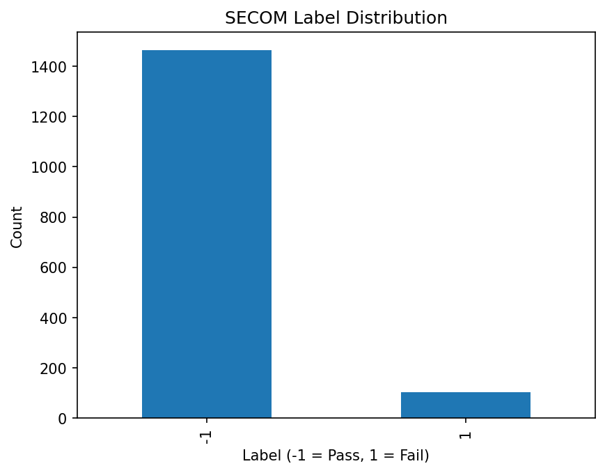

# Industrial Data Anomaly Detection

This repository is a portfolio project for applying data science and machine learning to anomaly detection and quality monitoring problems in industrial, scientific, and operational data.

The goal is to build a practical workflow that starts from raw public datasets and ends with interpretable model outputs for decision-making.

## Project Motivation

Real-world industrial data often contains missing values, sensor noise, abnormal patterns, class imbalance, and domain-specific failure modes.

This project focuses on building a reproducible workflow for:

- Data understanding
- Data cleaning and validation
- Exploratory data analysis
- Baseline modeling
- Model evaluation
- Error analysis
- Interpretation for quality monitoring and decision support

## Dataset

This project first uses the SECOM dataset from the UCI Machine Learning Repository.

SECOM is a public semiconductor manufacturing dataset for pass/fail classification, feature relevance analysis, and process monitoring. It contains anonymized process measurements, missing values, and highly imbalanced quality labels.

Dataset summary:

- Source: UCI Machine Learning Repository
- Domain: Semiconductor manufacturing
- Instances: 1,567
- Official feature count: 591
- Target label:
  - `-1`: Pass
  - `1`: Fail
- Missing values: Yes
- License: Creative Commons Attribution 4.0 International (CC BY 4.0)

Note: In this project, the feature matrix is loaded directly from `secom.data`, while the target label is loaded separately from `secom_labels.data`. The working feature matrix used in the EDA notebook contains 590 process feature columns.

No proprietary or confidential company data is used.

## Initial Scope

The first version focuses on the SECOM dataset and includes:

- Data loading from the original UCI raw files
- Label distribution analysis
- Feature-level missing value analysis
- Sample-level missing value analysis
- Initial interpretation of data quality issues
- Preparation for baseline classification modeling

## Initial EDA Results

The first exploratory data analysis was performed in:

```text
notebooks/01_eda.ipynb
```

The initial EDA focused on three basic questions:

1. How imbalanced is the pass/fail label distribution?
2. How much missing data exists across process features?
3. Are missing values concentrated in specific features or samples?

### Label Distribution

The SECOM dataset is highly imbalanced. Most samples are pass cases, while fail cases are rare.

This makes simple accuracy insufficient as an evaluation metric. For later modeling, fail-class recall, precision, F1-score, balanced accuracy, and confusion matrix analysis will be more important.



### Missing Value Analysis

The dataset contains missing values across process features.

Feature-level missing ratio was calculated as:

```text
missing_ratio = number of missing values in a feature / number of samples
```

This helps identify process variables that may be unreliable or too sparse for direct modeling.

Detailed missing value plots are available in the EDA notebook and saved under:

```text
reports/figures/
```

## Initial Findings

- The dataset has a strong class imbalance problem.
- Missing values are present across process features.
- Feature-level and sample-level missing ratios should be checked before modeling.
- Accuracy alone is not sufficient for evaluating fail detection performance.
- The next step is to build a baseline classification workflow with proper preprocessing and imbalance-aware evaluation.

## Repository Structure

```text
industrial-data-anomaly-detection/
├── README.md
├── LICENSE
├── .gitignore
├── requirements.txt
├── data/
│   └── README.md
├── notebooks/
│   └── 01_eda.ipynb
├── src/
│   └── placeholder.py
└── reports/
    └── figures/
        ├── label_distribution.png
        ├── feature_missing_ratio_distribution.png
        └── sample_missing_ratio_distribution.png
```

## Methods

Planned methods include:

- Exploratory data analysis
- Missing value handling
- Feature scaling
- Baseline classification models
- Imbalance-aware evaluation
- Error analysis and visualization

## Success Criteria

This project will be considered successful if it provides:

1. A clear problem definition
2. A reproducible data analysis workflow
3. Baseline modeling results
4. Visualizations that explain the data and model behavior
5. Practical interpretation from an industrial data perspective

## Current Status

Initial SECOM exploratory data analysis has been completed.

Next step:

```text
Build a baseline classification model for pass/fail prediction.
```

## Repository Policy

This repository uses only public datasets, personal study materials, and self-developed code.

No proprietary or confidential company data is included.

## Citation

McCann, M. & Johnston, A. (2008). SECOM [Dataset]. UCI Machine Learning Repository. https://doi.org/10.24432/C54305